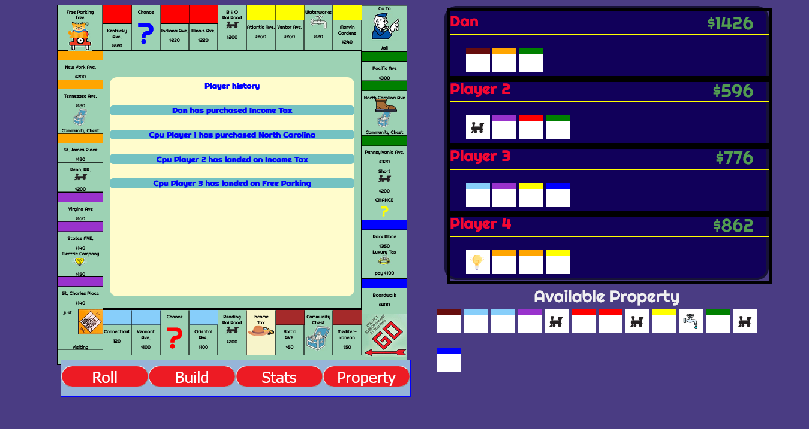
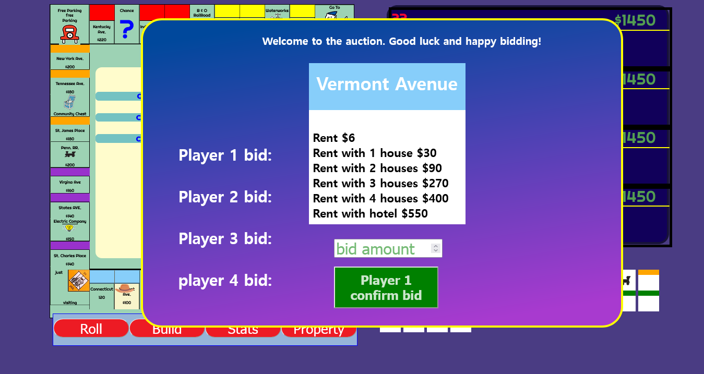
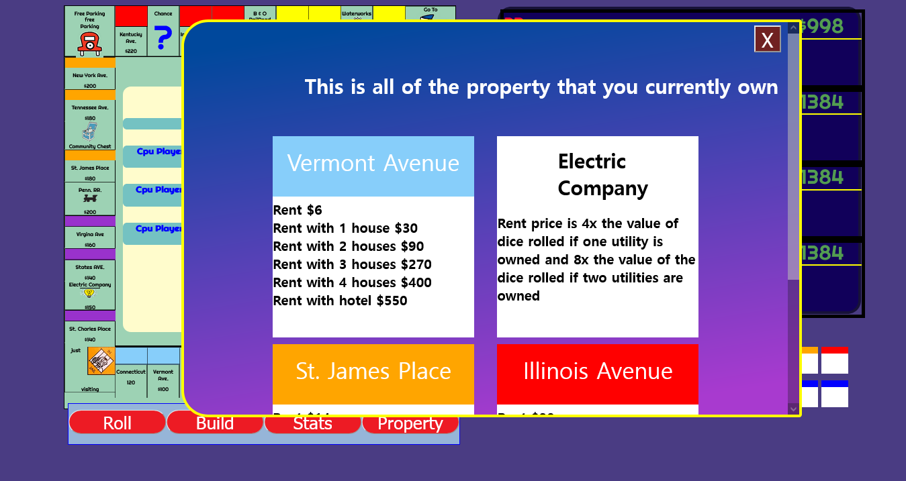
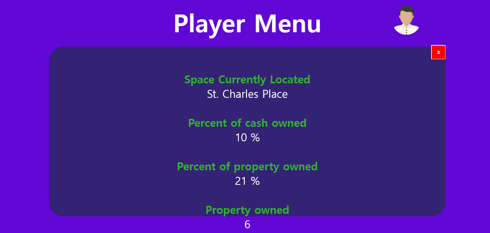

# Monopoly-

# This is Monopoly in html, css, javascript. 

### features ### 

This game has 3 computer players and one human controlled player. It has the ability to land on property and buy.  If a player doesn't decide to buy the property immediately, a seperate auction modal will popup. Other things such as build screen have been added for building houses. It's currently setup to only build houses and not hotels. I can consider adding those things later. 
 

## Game board ##

 The game board was made with CSS grid. A big mistake I made early one was defining a set pixel amount instead of relative CSS units. I decided to keep this and just use different transform levels depending on the screen size. It seems to work fine 

## Auction Modal ## 

 This modal lets players bid on different properties. I have a few different generic CPU player actions set up depending on the price of the property the CPU player will attempt to buy property within a certain range. In the future I could add a CPU behaviour that is set up for each property location but that may be beyond the scale of a simple portofio app. Maybe I'll get bored and do that one day. 

## Inventory Checker ## 

 This screen checks the inventory. I added this orignally for mobile. Because the mobile screen real estate is at a premium, I didn't want the player to not be able to see what property they had. At the same time I didn't want a bunch of property cards to pollute the game board. On mobile screens it will be really hard to see anyways. My solution was a modal. It uses flexbox. It is currently set to display a width of 2 cards. I feel that any smaller then it would be too hard to read. 

## Player Menu ## 

 The menu has a few pieces of information for the player. Most of this is pulled from the player object. To be honest this screens main point is to make the app look bigger. Because no trade menu has been implemented I didn't want a smaller number of main buttons located on the game board. Mainly kept in for aestheitcs. 

## Possible Ideas for the future ## 

####  A trade Screen #### 

 It's really hard to play a game without a proper trade screen. 

 The CPU is very primitive. It probably cannot even be definied as a CPU. It has a few checks for property values and that is it. The CPU auction bids are very simple and could be beefed up.  

 The jail settings are non existant. Just pay a fine and no ability to do anything else. I could fix that 

The ability to buy Motels hasn't been implemented yet. 

## Mobile Version ## 

 Some of the mobile features are slightly different. Most notably the small property cards are not shown within the player container. I just didn't think it would allow for a good experience so those things are hidden. 
