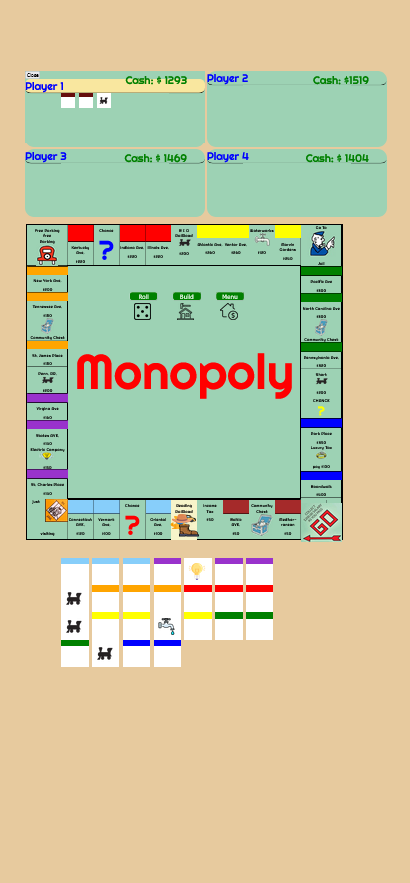

# Monopoly-

# This is Monopoly in html, css, javascript. 

Features - 

It has board movement from the player and the CPU but the CPU player functionality as of right now is extremely limited. The CPU can buy property but there 
is not any complex decisions being done by the CPU. I hope to add that at a later time. 

There are several modals throughout the game. There is a buy property modal, a modal that instructs the player once they land on a space, go to jail modals etc. 
I'm hoping to add more stylings to these modals because they are very simple and not styled well. 

There is no trading feature which I want to add at a later time. I'm still considering what kind of things I would like to add. A big mistake I made when I 
first started making this game is that I didn't have a clear structure planned out before  I started writing code. A mistake  I don't plan on making again. 

The mobile styling is currently set up but it's only for the main screen. More sub menus need to be fixed for mobile. Once again I wish I was more experienced when I first
started working on this game or else  I would have planned for mobile stylings at an earlier time.

A screenshot. It's ugly, but it's progress. \

<<<<<<< HEAD
That's it for now July 14, 2022
=======
That's it for now July 14, 2022

>>>>>>> f8a434ef5ffcc384ad29613f9df75ffbd7d2360f
